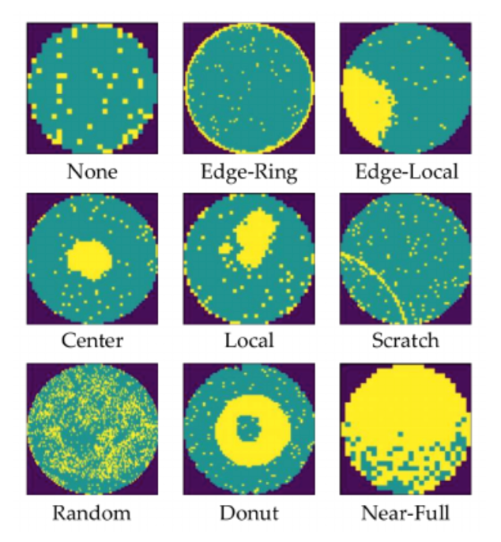
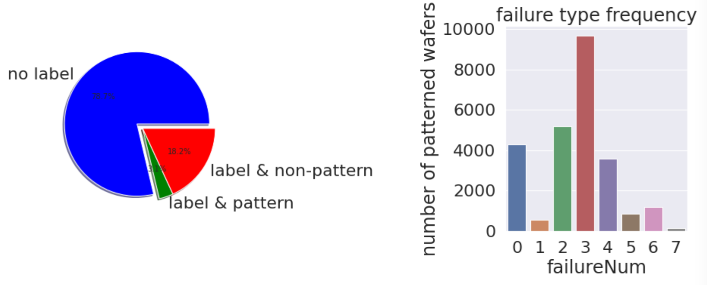
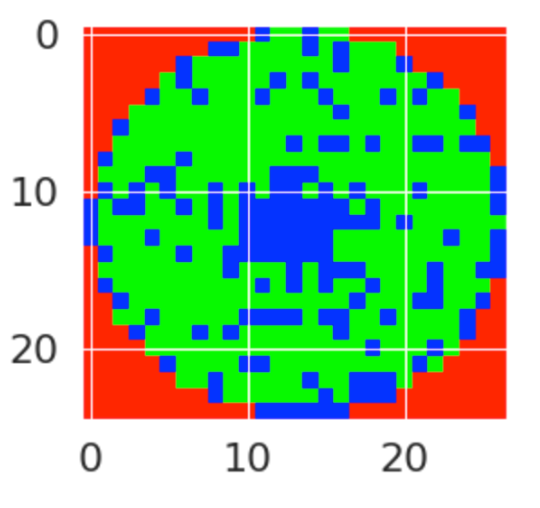
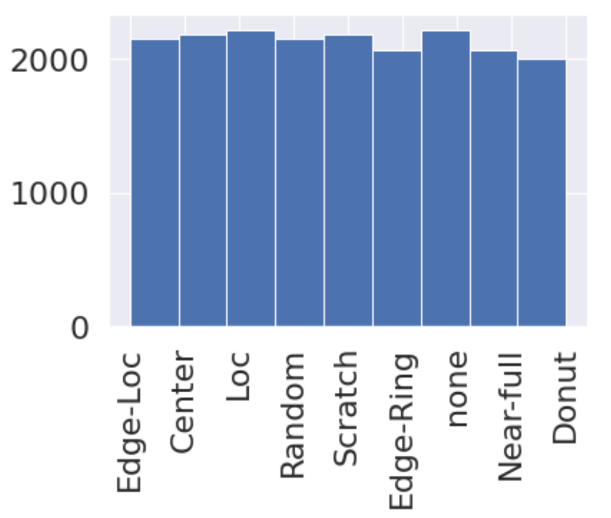
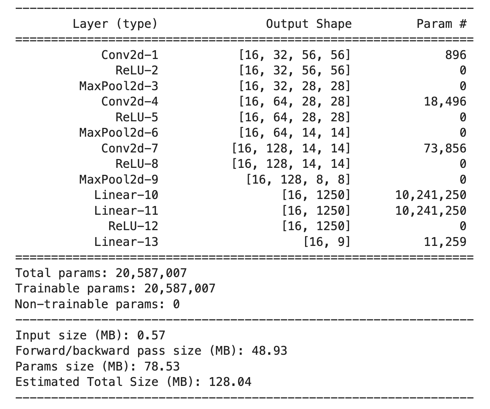
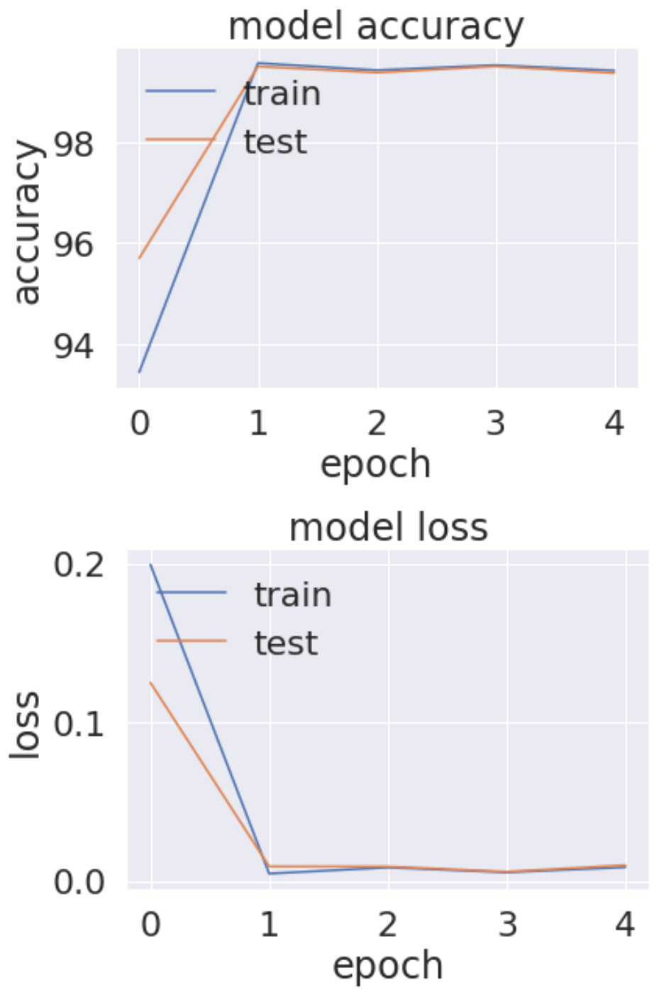

# wafermap-defect-recogniztion

This repository contains followings:
- Presentation slides
- Experiment notebook

## Goal:

As semiconductor manufacturing becomes complicated, and the difficulty of the refined process techniques increases, it is crucial to classify wafer maps automatically to eliminate the cause of defects. In this project, we are going to develop deep learning model to identify the defect patterns from input images in a supervised manner. 

## Exploratory Data Analysis:

According to the EDA analysis, data with label & pattern only takes only 3.1% of total data and the distribution of label for different failure is imbalance. Thus we are only considering data with labels in the training process.

## Data Augmentation

Here we are going to reshape images to have same dimension and using (R, G, B) channel to represent different area. 

For data augmentation, we trained AutoEncoder to oversampling minority class by adding gaussian noise, and we also use random undersample technique to undersample majority class. By doing that, we have achieved the number of samples for each pattern below. 

## Convolution Neural Network Model

We utilized the following parts in the CNN model, 

1. Feature Learning Layers  
    Convolution + RELU + MaxPool 
2. Classifier (Fully Connected Layers)  
    Linear Layers + RELU + SoftMax
3. Loss Function  
    Cross Entropy Loss

## Final Results

After we trained 10 epochs for 5 cross validation fold, we have achieved **99.61%** accuracy.

